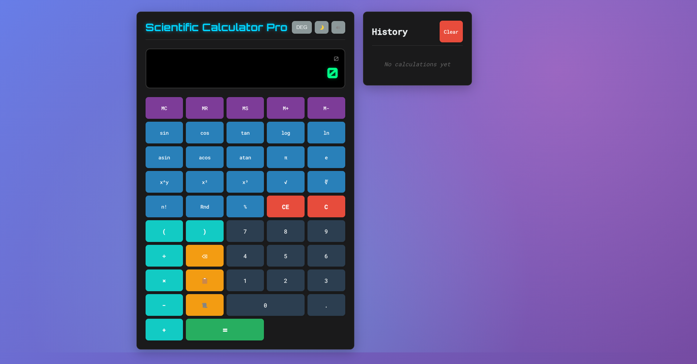

# 🧮 Scientific Calculator Pro

A comprehensive, production-ready scientific calculator built with vanilla JavaScript, featuring advanced mathematical functions, memory operations, calculation history, and a beautiful responsive design. Perfect for students, engineers, scientists, and professionals who need reliable mathematical computations.



---

## ✨ Features

### 🔢 Core Mathematical Operations
- **Basic Arithmetic**: Addition, subtraction, multiplication, division
- **Advanced Functions**: Powers, roots, logarithms, factorials
- **Trigonometry**: Sin, cos, tan and their inverse functions
- **Constants**: π (Pi) and e (Euler's number) with full precision
- **Parentheses**: Support for complex nested expressions

### 🧠 Memory System
- **MS (Memory Store)**: Save current value to memory
- **MR (Memory Recall)**: Retrieve stored memory value
- **MC (Memory Clear)**: Clear memory storage
- **M+ (Memory Add)**: Add current value to memory
- **M- (Memory Subtract)**: Subtract current value from memory
- **Visual Indicator**: Memory status indicator with persistent storage

### 📊 Calculation History
- **Smart History**: Displays last 10 calculations with FIFO queue
- **Interactive Recall**: Click any history item to recall the result
- **Expression Display**: Shows both the expression and result
- **Persistent Storage**: History survives browser sessions
- **Clear Function**: Easy history management

### 🎨 Modern User Interface
- **Professional Design**: Sleek dark/light theme with smooth transitions
- **Responsive Layout**: Optimized for desktop, tablet, and mobile devices
- **Smooth Animations**: Button press effects, hover states, and transitions
- **Typography**: Calculator-specific Orbitron font for authentic feel
- **Accessibility**: ARIA labels, keyboard navigation, and high contrast

### ⌨️ Input Methods
- **Mouse Support**: Clickable buttons with visual feedback
- **Full Keyboard Support**: 
  - Numbers (0-9), operators (+, -, *, /)
  - Enter/= for calculation, Escape for clear
  - Backspace for delete, Delete for all clear
  - Parentheses, decimal point, and function keys
- **Touch Optimized**: Perfect for mobile and tablet devices

### 🔧 Advanced Features
- **Angle Modes**: Degrees, radians, and gradians for trigonometry
- **Error Handling**: Comprehensive error detection and user-friendly messages
- **Scientific Notation**: Automatic formatting for very large/small numbers
- **Sound Effects**: Optional button click sounds with toggle control
- **Copy to Clipboard**: Easy result sharing
- **PWA Support**: Install as a native app on any device

<br/>

## 🚀 Demo

**Live Demo**: [Scientific Calculator Pro]()

<br/>

## 📦 Installation

### 1. Clone the repository:
   ```bash
    git clone https://github.com/CristianGonzalez24/calculator-web.git
   ```

### 2. Navigate to the Project Directory:
  ```bash
    cd calculator-web
  ```

### 3. Install Dependencies:
  ```bash
    npm install
  ```

### 4. Start the Development Server:
  ```bash
    npm run dev
  ```

The application should now be running on `http://localhost:5173/` by default.

<br/>

## 🎯 Usage

### Basic Operations
```
Example: 25 + 75 = 100
1. Click numbers: 2, 5
2. Click operator: +
3. Click numbers: 7, 5
4. Click equals: =
Result: 100
```

### Advanced Functions
```
Example: sin(30°) = 0.5
1. Ensure angle mode is set to DEG
2. Click: sin
3. Enter: 30
4. Click: =
Result: 0.5
```

### Memory Operations
```
Example: Store and recall values
1. Calculate: 15 × 4 = 60
2. Click: MS (Memory Store)
3. Perform other calculations
4. Click: MR (Memory Recall)
Result: 60 is recalled
```

### Keyboard Shortcuts
| Key | Function | Key | Function |
|-----|----------|-----|----------|
| `0-9` | Numbers | `+` | Addition |
| `.` | Decimal | `-` | Subtraction |
| `Enter` | Calculate | `*` | Multiplication |
| `Escape` | Clear All | `/` | Division |
| `Backspace` | Delete | `(` `)` | Parentheses |

<br/>

## 🛠️ Technology Stack

- **Frontend**: HTML5, CSS3, Vanilla JavaScript (ES6+)
- **Fonts**: Google Fonts (Orbitron, Roboto Mono)
- **Storage**: localStorage for persistence
- **PWA**: Web App Manifest, Service Worker ready
- **Build**: No build process required - pure vanilla implementation

<br/>

## 📁 Project Structure

```
calculator-web/
├── node_modules          # Dependencies
├── public 
│   ├── icons/            # PWA icons (various sizes)
│   │   ├── icon-192x192.png
│   │   ├── icon-512x512.png
│   │   └── ...
│   ├── screenshots/      # Demo screenshots
│   ├── favicon.ico
│   ├── site.webmanifest  # PWA manifest file
│
│── .gitignore
├── history.js            # Calculation history management
├── index.html            # Main HTML structure
├── main.js               # Main calculator logic and UI
├── memory.js             # Memory management system
├── README.md            # This file
├── style.css             # Complete styling and themes
└── utils.js              # Utility functions and constants
```

### File Responsibilities

| File | Purpose |
|------|---------|
| `calculator.js` | Main application logic, event handling, UI management |
| `utils.js` | Mathematical utilities, formatting, validation functions |
| `memory.js` | Memory operations (MS, MR, MC, M+, M-) with persistence |
| `history.js` | Calculation history with FIFO queue and recall functionality |
| `style.css` | Complete styling, themes, responsive design, animations |

<br/>

## 🧪 Testing

### Manual Testing Checklist
- [ ] Basic arithmetic operations (+ - × ÷)
- [ ] Advanced functions (sin, cos, tan, log, ln, √, x²)
- [ ] Memory operations (MS, MR, MC, M+, M-)
- [ ] History recall functionality
- [ ] Keyboard input support
- [ ] Error handling (division by zero, domain errors)
- [ ] Responsive design on different screen sizes
- [ ] PWA installation and offline functionality

### Browser Compatibility
- ✅ Chrome 80+
- ✅ Firefox 75+
- ✅ Safari 13+
- ✅ Edge 80+
- ✅ Mobile browsers (iOS Safari, Chrome Mobile)

<br/>

## 🤝 Contributing

We welcome contributions! Please follow these steps:

1. **Fork the repository**
2. **Create a feature branch**: `git checkout -b feature/amazing-feature`
3. **Make your changes** and test thoroughly
4. **Commit your changes**: `git commit -m 'Add amazing feature'`
5. **Push to the branch**: `git push origin feature/amazing-feature`
6. **Open a Pull Request**

### Development Guidelines
- Follow existing code style and conventions
- Add JSDoc comments for new functions
- Test on multiple browsers and devices
- Update README if adding new features
- Ensure accessibility standards are maintained

### Code Style
- Use ES6+ features consistently
- Maintain modular architecture
- Follow semantic naming conventions
- Add comprehensive error handling
- Include performance considerations

<br/>

## 📋 Roadmap

### Upcoming Features
- [ ] **Graphing Calculator**: Plot mathematical functions
- [ ] **Unit Converter**: Length, weight, temperature conversions
- [ ] **Equation Solver**: Solve algebraic equations
- [ ] **Matrix Operations**: Basic matrix calculations
- [ ] **Statistics Functions**: Mean, median, standard deviation
- [ ] **Custom Functions**: User-defined mathematical functions
- [ ] **Themes**: Additional color schemes and customization
- [ ] **Export/Import**: Save and share calculations

### Performance Improvements
- [ ] Service Worker for offline functionality
- [ ] Lazy loading for advanced features
- [ ] WebAssembly for complex calculations
- [ ] Touch gesture support

<br/>

## 🙏 Acknowledgments

- **Google Fonts** for the beautiful Orbitron and Roboto Mono typefaces
- **MDN Web Docs** for comprehensive web development documentation
- **Calculator design inspiration** from modern scientific calculators
- **Open source community** for best practices and code patterns
- **Beta testers** who provided valuable feedback and bug reports

<br/>

## 📊 Project Stats


<br/>

## 👨‍💻 Author

**Cristian Gonzalez**
- GitHub: [@CristianGonzalez24](https://github.com/CristianGonzalez24)
<!-- - LinkedIn: [Your LinkedIn](https://linkedin.com/in/yourprofile) -->
- Email: cristianfabgonzalez@gmail.com
<!-- - Website: [yourwebsite.com](https://yourwebsite.com) -->

<br/>

## 📜 License 

This project is licensed under the **MIT License**. See the [LICENSE](LICENSE) file for more details.

---

<div align="center">
  <p>Made with ❤️ for the developer community</p>
  <p>⭐ Star this repo if you found it helpful!</p>
</div>